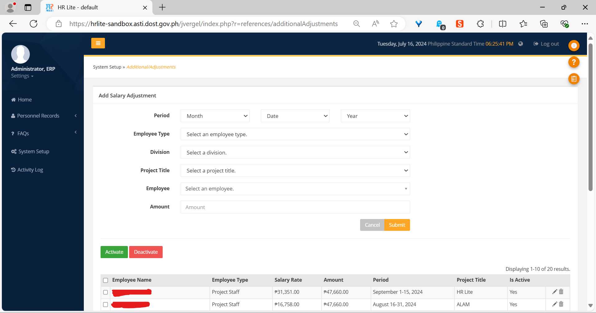
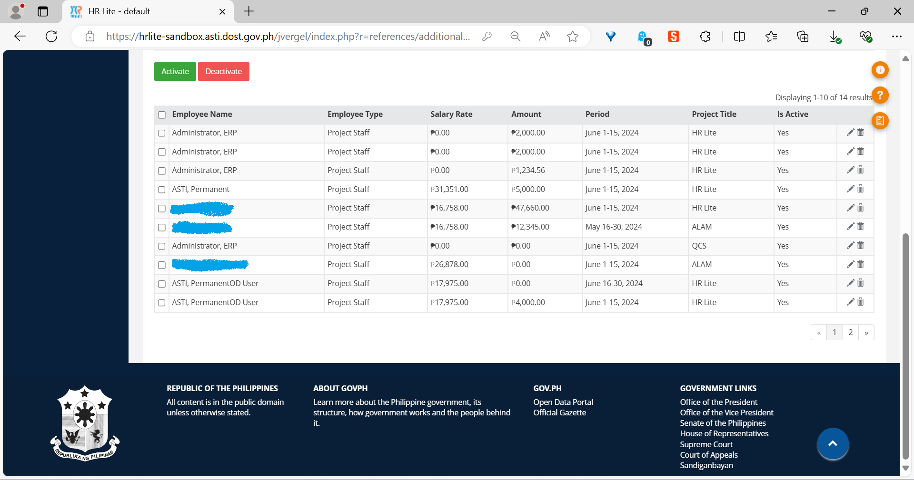

The Additional/Adjustments module
=================================

   Top portion of the *Additional/Adjustments* page, showing the *Add Salary
   Adjustment* form.

   Bottom portion of the *Additional/Adjustments* page, showing the salary
   adjustments table.

How to add a salary adjustment
------------------------------

.. Note:: Make sure your account has been granted the necessary action for
   this first.

1. In the *Period* field, specify the month, period, and year of the payroll
   you wish to add the salary adjustment to.
2. Select an employee type in the *Employee Type* field.
3. Select the employee’s division in the *Division* field.
4. Select the employee’s project in the *Project Title* field.
5. Select the employee to grant the salary adjustment to in the *Employee*
   field.
6. Finally, enter the amount to add to the employee’s salary in the *Amount*
   field.
7. Click the *Submit* button.

The newly entered salary adjustment must appear in the table in the last row.
