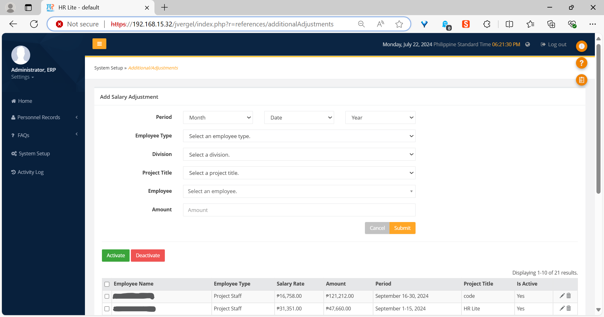
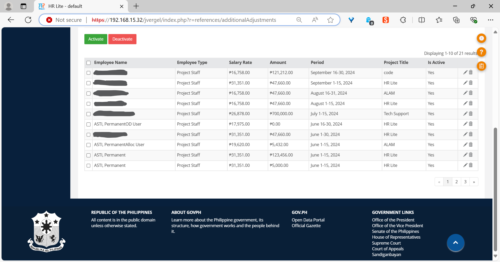
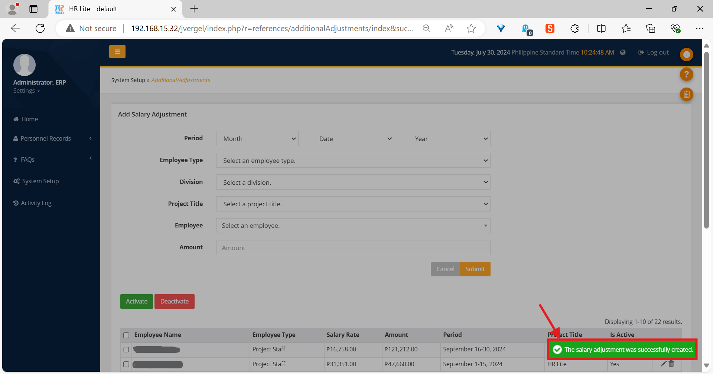
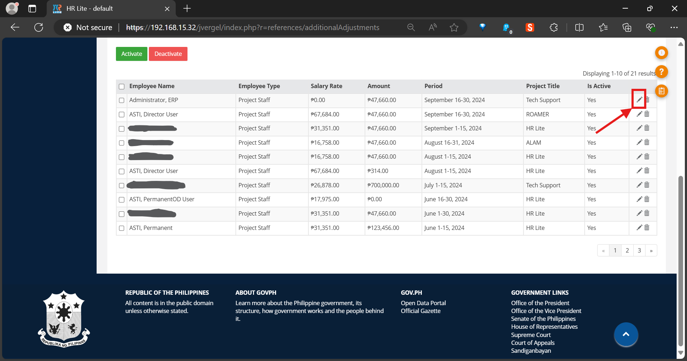
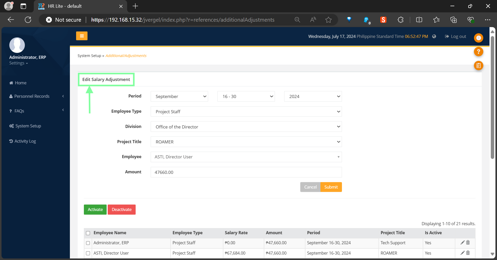
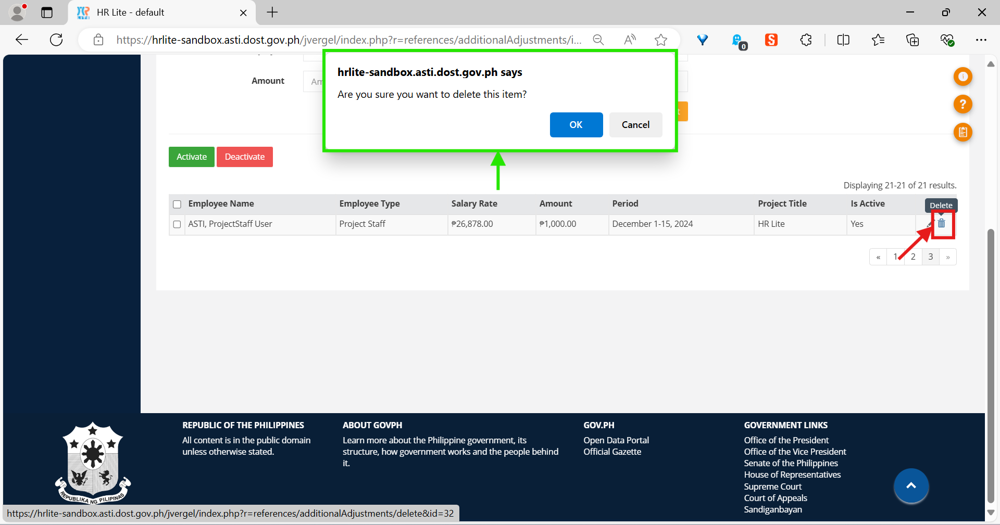

The *Additional/Adjustments* library
====================================

Introduction
------------

The *Additional/Adjustments* library is used to attach arbitrary amounts of
money coming from grants that are otherwise not handled by any other library
in the Payroll Module to the salaries of employees.

The salary adjustment form
--------------------------

   Top portion of the *Additional/Adjustments* page, showing the salary
   adjustment form.

The *salary adjustment form* is where you will be adding new salary adjustments
or editing currently existing ones.

It has six fields:

* The *Period* field contains the time period in which the salary adjustment
  will be given to the employee. It has three smaller fields: *Month*, *Date*,
  and *Year*.
* The *Employee Type* field is used to filter the list of employees in the
  *Employee* field according to employee type (e.g. “Project Staff” or
  “Permanent”).
* The *Division* field is used to filter the list of employees in the
  *Employee* field according to division.
* The *Project Title* field is used to filter the list of employees in the
  *Employee* field according to project title.
* The *Employee* field contains the employee that will receive the salary
  adjustment.
* The *Amount* field contains the specific amount that will be added to the
  employee’s salary.

There are also two buttons on the bottom right: the *Cancel* button which
resets the form, and the *Submit* button which submits all the data in the
form.

The salary adjustments table
----------------------------

   Bottom portion of the *Additional/Adjustments* page, showing the salary
   adjustments table.

The *salary adjustments table* is where all the salary adjustments that have
ever been added are listed.

There are seven columns in the table:

* The *Employee Name* column contains the name of the employee that received
  the salary adjustment.
* The *Employee Type* column contains the employee type of the employee (e.g.
  “Project Staff” or “Permanent”) as of the time specified in the *Period*
  column.
* The *Salary Rate* column contains the salary rate of the employee as of the
  time specified in the *Period* column.
* The *Amount* column contains the amount that was added to the employee’s
  salary.
* The *Period* column contains the period in which the salary adjustment was
  given to the employee.
* The *Project Title* column contains the code of the project title that the
  employee belonged to as of the time specified in the *Period* column.
* The *Is Active* column shows whether the salary adjustment is available for
  use in other parts of HR Lite and the Payroll Module.

The rows in the table are sorted by period descending — i.e. the rows for the
latest period are listed first. They each will have a checkbox to their left
for selecting, and two buttons to the right for editing and deleting them.

There is also a checkbox on the top left corner of the table for selecting all
rows that are **currently** displayed in the table.

There are also two buttons above the table:

* The *Activate* button, colored green, sets the status of any selected
  employees in the table to active. Active salary adjustments have a value of
  “Yes” in the *Is Active* column of the table.
* The *Deactivate* button, colored red, sets the status of any selected
  employees in the table to inactive. Inactive salary adjustments have a value
  of “No” in the *Is Active* column of the table.

How to add a salary adjustment
------------------------------

.. Note:: Make sure your account has been granted the necessary action for
   this first.

1. Go to the salary adjustment form.
2. In the *Period* field, specify the month, period, and year of the payroll
   you wish to add the salary adjustment to.
3. Select an employee type in the *Employee Type* field.
4. Select the employee’s division in the *Division* field.
5. Select the employee’s project in the *Project Title* field.
6. Select the employee to grant the salary adjustment to in the *Employee*
   field.
7. Finally, enter the amount to add to the employee’s salary in the *Amount*
   field.
8. If you want to clear the contents of the form (i.e. “reset” it) click on
   the *Cancel* button.
9. Click the *Submit* button to save the salary adjustment.

A notification will appear in the bottom right of the application if the
salary adjustment was successfully saved.

   A notification will appear after a salary adjustment is successfully
   created.

How to edit a salary adjustment
-------------------------------

.. Note:: Make sure your account has been granted the necessary action for
   this first.

1. Click on the update button (the one with a pencil icon) of any entry in the
   salary adjustments table that you wish to edit.
2. The salary adjustment’s data will be loaded into the salary adjustment form.
   You might also notice that the form header now reads *Edit Salary
   Adjustment* instead of *Add Salary Adjustment*. Make any changes you wish to
   do in the form, then click the *Submit* button once you’re done.
3. To reset the form, click on the *Cancel* button. The form header will revert
   back to *Add Salary Adjustment*, and submitting the form will result in the
   addition of a new salary adjustment this time, not the updating of an
   existing one.

   Location of the update button.

   After clicking the update button for your chosen salary adjustment, its data
   will be loaded into the form. The header, marked in green, will also change.

A notification should appear in the bottom right if the updating of the salary
adjustment’s information was successful.

How to delete a salary adjustment
---------------------------------

.. Note:: Make sure your account has been granted the necessary action for
   this first.

1. Click the delete button (the one with a trash can icon) of any entry in
   the salary adjustments table that you wish to delete.
2. A confirm dialog will appear near the top of the window. Click *OK* to
   proceed with the deletion, or *Cancel* if you wish to stop.

   The application will be asking you whether you *actually* want to
   proceed with the deletion. The location of the delete button is also
   marked in red.

You should see a notification at the bottom right of the page telling you that
the deletion was successful.
