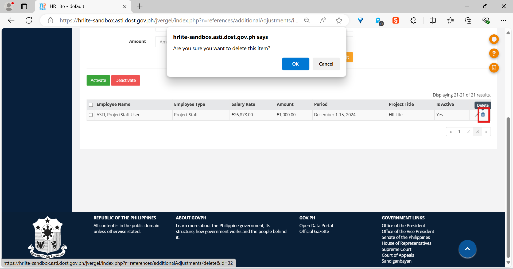
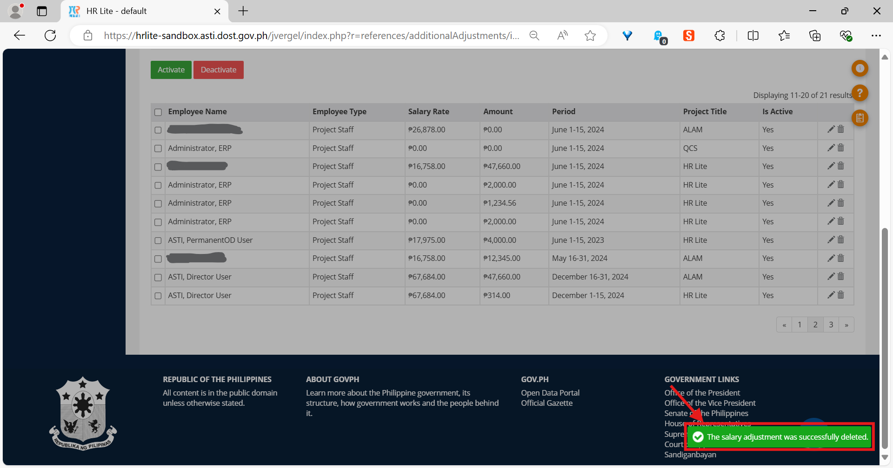

The *Additional/Adjustments* library
====================================

Introduction
------------

The *Additional/Adjustments* library is used to attach arbitrary amounts of
money coming from grants that are otherwise not handled by any other library
in the Payroll Module to the salaries of employees.

The salary adjustment form
--------------------------

.. figure:: illustrations/additional-adjustments-page-top.png

   Top portion of the *Additional/Adjustments* page, showing the salary
   adjustment form.

How to add a salary adjustment
^^^^^^^^^^^^^^^^^^^^^^^^^^^^^^

.. Note:: Make sure your account has been granted the necessary action for
   this first.

1. Go to the salary adjustment form.
2. In the *Period* field, specify the month, period, and year of the payroll
   you wish to add the salary adjustment to.
3. Select an employee type in the *Employee Type* field.
4. Select the employee’s division in the *Division* field.
5. Select the employee’s project in the *Project Title* field.
6. Select the employee to grant the salary adjustment to in the *Employee*
   field.
7. Finally, enter the amount to add to the employee’s salary in the *Amount*
   field.
8. If you want to clear the contents of the form (i.e. “reset” it) click on
   the *Cancel* button.
9. Click the *Submit* button to save the salary adjustment. The newly saved
   salary adjustment must appear as the first row in the table.

The salary adjustments table
----------------------------

The *salary adjustments table* is where all the salary adjustments that have
ever been added are listed. Its rows are sorted by period descending (i.e., the
rows for the latest period are listed first).

.. figure:: illustrations/additional-adjustments-page-bottom.png

   Bottom portion of the *Additional/Adjustments* page, showing the salary
   adjustments table.

How to delete a salary adjustment
^^^^^^^^^^^^^^^^^^^^^^^^^^^^^^^^^

.. Note:: Make sure your account has been granted the necessary action for
   this first.

1. Click the delete button (the one with a trash can icon) of any entry in
   the salary adjustments table that you wish to delete.
2. A confirm dialog will appear near the top of the window. Click *OK* to
   proceed with the deletion, or *Cancel* if you wish to stop.
3. You should see a notification at the bottom right of the page telling
   you that the deletion was successful.

   The application will be asking you whether you *actually* want to
   proceed with the deletion. The location of the delete button is also
   marked in red.

   A notification will appear after a successful deletion.
