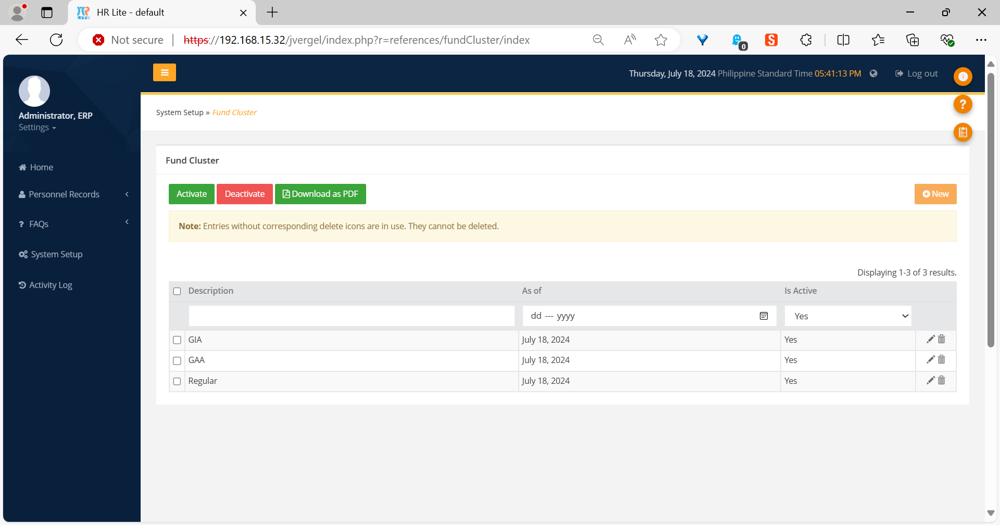
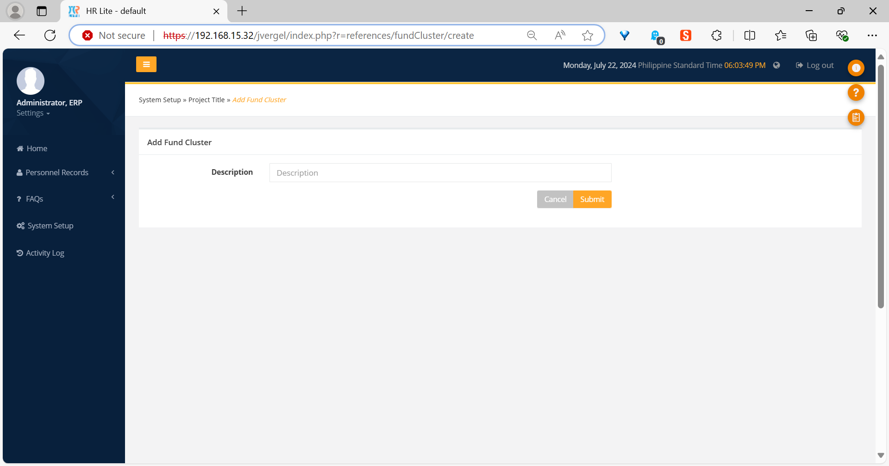
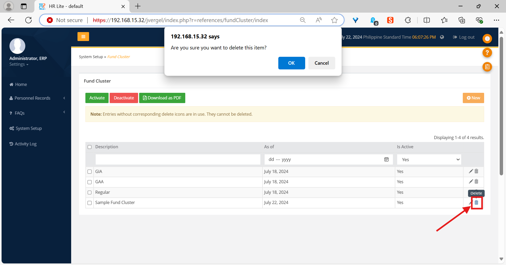
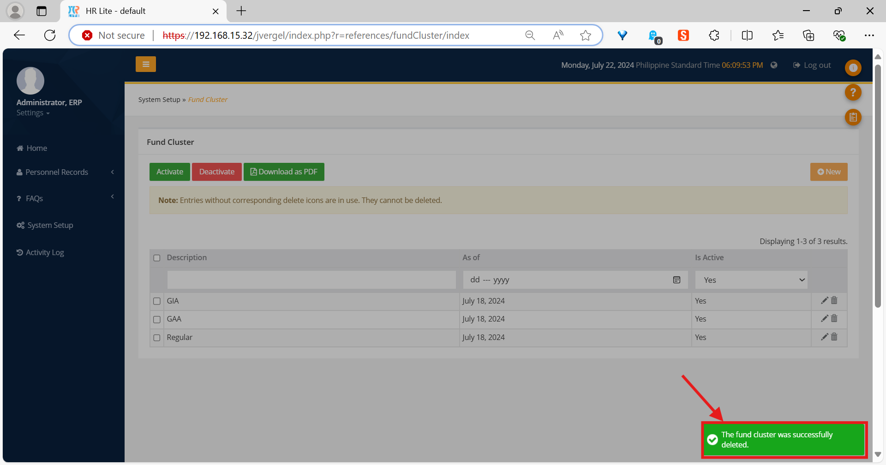

The *Fund Cluster* library
==========================

Introduction
------------

The *Fund Cluster* library is where all information about Fund Clusters can be
managed.

Fund Clusters are “[aggregations] of Funding Sources for the purpose of
recording transactions and preparing report in the Budget, Treasury, and
Accounting processes.” [1]_

The index page
--------------

   The *Fund Cluster* index page.

The index page is where you will find a list of all the Fund Clusters saved in
the database, as well as a few buttons that are described in the following
list.

* The *Activate* button sets any Fund Clusters that are selected in the table
  as active. Active Fund Clusters have a value of “Yes” in the *Is Active*
  column.
* The *Deactivate* button sets any Fund Clusters that are selected in the table
  as inactive. Inactive Fund Clusters have a value of “No” in the *Is Active*
  column.
* The *Download as PDF* button generates a PDF report of all the Fund Clusters
  in the system.
* The *New* button brings you to an empty form page, where you will be able to
  add a new Fund Cluster. The form page is described in the next section.

The form page
-------------

   The *Fund Cluster* form page.

The form page is where you will be able to enter or change information about
any Fund Clusters you wish to add or edit. It has only one field, labeled
*Description*, which will contain the Fund Cluster’s description.

How to add a Fund Cluster
-------------------------

.. Note:: Make sure your account has been granted the necessary action for
   this first.

1. In the index page, click on the *New* button near the top right corner.
2. You will be brought to the form page. Enter a description for the new Fund
   Cluster in the *Description* field.
3. If you want to clear the form and start over, click on the *Cancel* button.
4. Click on the *Submit* button when you’re done.

The new Fund Cluster should appear in the Fund Cluster table.

How to edit a Fund Cluster
--------------------------

.. Note:: Make sure your account has been granted the necessary action for
   this first.

1. In the Fund Cluster table, click the update button (the one with a pencil
   icon) for the Fund Cluster that you wish to edit. You will be brought to the
   form page.
2. The *Description* field will contain the current description for the Fund
   Cluster. You can change it into anything you wish.
3. Click on the *Submit* button once done.

The Fund Cluster will have a new description in the table. Its last updated
date (shown under the *As of* column) will also have changed.

How to delete a Fund Cluster
----------------------------

.. Note:: Make sure your account has been granted the necessary action for
   this first.

1. In the Fund Cluster table, click the delete button (the one with the trash
   can icon) for the Fund Cluster that you wish to delete.
2. A confirmation dialog will appear in the top portion of the app. Click *OK*
   if you want to proceed with the deletion, or *Cancel* if you wish to stop.

   The confirmation dialog for deleting a Fund Cluster, as well as the location
   of the delete button (marked in red).

A notification will appear on the bottom right of the app if the deletion was
successful.

   A notification will appear after the Fund Cluster is successfully deleted.

.. rubric:: Footnotes

.. [1] “Funding Source Code.” Unified Accounts Code Structure. Accessed July
   23, 2024. [Online.] Available: https://uacs.gov.ph/primer/36/funding-source-code