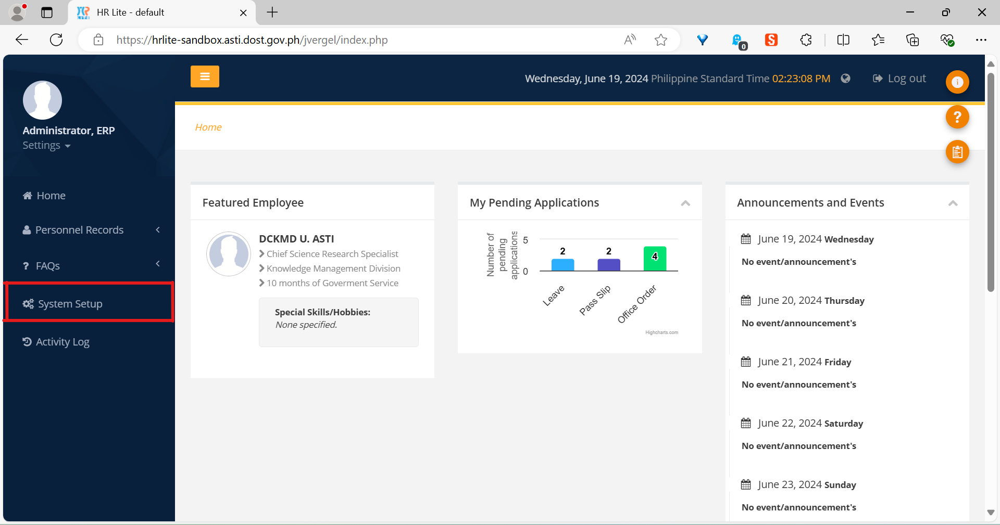
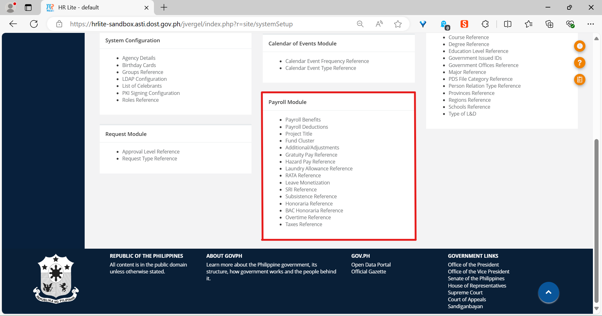

Introduction
============

Libraries
---------

Libraries under the Payroll Module can be found in the *System Setup* page,
which can be accessed anytime by clicking on the *System Setup* menu item
in the sidebar to the left.

   Location of the *System Setup* link in the sidebar.

The links to all the libraries are listed in the *Payroll Module* box,
highlighted in red in the illustration. Each library will have its own
chapter dedicated to it.

   The *Payroll Module* box contains links to various payroll-related
   libraries.
