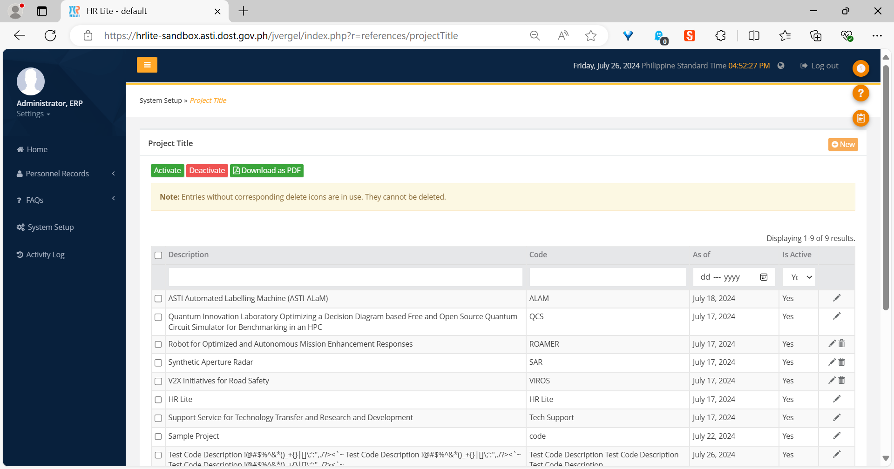

The *Project Title* library
===========================

Introduction
------------

The *Project Title* library is where all information about projects handled
by the organization can be managed.

The index page
--------------

   The *Project Title* index page.

The *index page* contains a table listing all the project titles in the system,
as well as some buttons that will be described in the following list.

* The *New* button brings you to an empty form page, where you will be able to
  create a new project title. The form page is described in the next section.
* The *Activate* button sets any project titles that are selected in the table
  as active. Active project titles have a value of “Yes” in the *Is Active*
  column of the table.
* The *Deactivate* button sets any project titles that are selected in the
  table as inactive. Inactive project titles have a value of “No” in the *Is
  Active* column of the table.
* The *Download as PDF* button generates a PDF report of all the project titles
  in the system.

The form page
-------------

.. figure:: illustrations/project-title--form-page.png

   The *Project Title* form page.

The *form page* is where you can enter any information you wish for the project
title you want to add; or change any information for the project title you are
currently editing.

It has three fields:

1. The *Code* field contains the code of the project title.
2. The *Description* field contains the description of the project title.
3. The last field is a huge one, bound by horizontal lines at the top and
   bottom. It is for containing the members of the project title and has three
   smaller fields:

   a. The *Selected Employees* field is the actual container of the members of
      the project title.
   b. The *List of Employees* field is where you can select employees that you
      would like to make members of the project title.
   c. The *Employee Type* field is used to filter the contents of the *List of
      Employees* field. For example, if the value of the *Employee Type* field
      is “Project Staff,” then the contents of the *List of Employees* field
      will all be project staff employees.
   
   The buttons between the *List of Employees* and *Selected Employees* fields
   are used to move employees back and forth between them. Their functionality
   will be explained later.

The *Cancel* button at the bottom right of the form brings you to the index
page, where you most likely would have come from before landing in the form
page. The button next to it submits the contents of the form and will be
labeled either *Add* or *Edit* depending on what you will be doing.

How to add a project title
--------------------------

.. Note:: Make sure your account has been granted the necessary action for
   this first.

1. In the index page, click the *New* button to go to a blank form page.
2. Enter the project title’s code in the *Code* field.
3. Enter the project title’s description in the *Description* field.
4. Select any employee you wish to add as project title members by clicking on
   their name in the *List of Employees* field then clicking on the right
   single angle quote button (“›”) so that it moves to the *Selected Employees*
   field. To select multiple employees, click on their names while holding the
   *Ctrl* button.
5. If you want to add *all* employees in the *List of Employees* field, click
   on the right double angle quote button (“»”). You don’t need to select all
   of them first.
6. To remove any employees in the *Selected Employees* field that you don’t
   want to add anymore, click on their name then click on the left single angle
   quote button (“‹”). It will move back to the *List of Employees* field.
7. To move *all* employees in the *Selected Employees* field back to the *List
   of Employees* field, click on the left double angle quote button (“«”).
   You don’t need to select any employees first.
8. Changing the value of the *Employee Type* field will change the employees
   listed in the *List of Employees* button. For example, if the *Employee
   Type* field has a value of “Project Staff,” the *List of Employees* staff
   will list only project staff employees.
9. Once you are done, click on the *Add* button.

You should be returned to the index page, with your new project title as the
last item in the table and a success notification at the bottom right of the
application.

   A notification appears after the successful addition of a project title.

How to edit a project title
---------------------------

.. Note:: Make sure your account has been granted the necessary action for
   this first.

1. Click the update button (the one with a pencil icon) of any project title in
   the table that you wish to edit.
2. Make any changes in the form that you wish to do.
3. Click the *Edit* button once done.

   The location of the update button, marked in red.

You should be returned to the index page with a success notification at the
bottom right of the application. You should also find that the project title
you edited now has updated information.

How to delete a project title
-----------------------------

.. Note:: Make sure your account has been granted the necessary action for
   this first.

1. Click the delete button (the one with a trash can icon) of any project title
   you wish to delete.
2. A confirmation dialog will appear at the top of the application. Click *OK*
   to proceed with the deletion, or *Cancel* if you wish to stop.

.. Warning:: There might be some project titles in the table that do not have a
   delete button. It means that the project title is being used in other parts
   of the Payroll Module or HR Lite, and you are not allowed to delete them.

.. figure:: illustrations/project-title--delete-confirmation-and-button-location.png

   The system will ask for confirmation when you click the delete button
   (location marked in red).

A notification will appear at the bottom right of the application if the
deletion was successful. Deletions are permanent and cannot be undone.