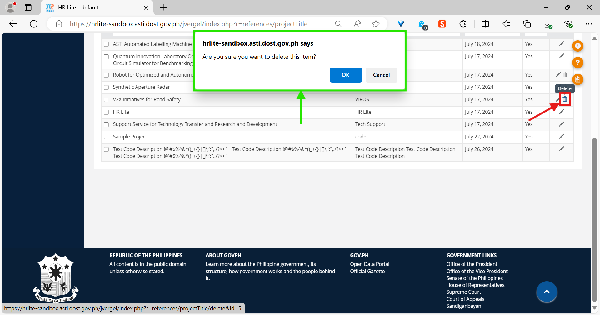

The *Project Title* library
===========================

Introduction
------------

The *Project Title* library is where all information about projects handled
by the organization can be managed.

The index page
--------------

.. figure:: illustrations/project-title--index-page.png

   The *Project Title* index page.

The *index page* contains a table listing all the project titles in the system,
as well as some buttons that will be described in the following list.

* The *New* button (TBD)
* The *Activate* button (TBD)
* The *Deactivate* button (TBD)
* The *Download as PDF* button (TBD)

The form page
-------------

   The *Project Title* form page.

The *form page* is where you can enter any information you wish for the project
title you want to add; or change any information for the project title you are
currently editing.

How to add a project title
--------------------------

.. Note:: Make sure your account has been granted the necessary action for
   this first.

1. In the index page, click the *New* button to go to a blank form page.
2. Enter the project title’s code in the *Code* field.
3. Enter the project title’s description in the *Description* field.
4. Select any employee you wish to add as project title members by clicking on
   their name in the *List of Employees* field then clicking on the right
   single angle quote button (“›”) so that it moves to the *Selected Employees*
   field. To select multiple employees, click on their names while holding the
   *Ctrl* button.
5. If you want to add *all* employees in the *List of Employees* field, click
   on the right double angle quote button (“»”). You don’t need to select all
   of them first.
6. To remove any employees in the *Selected Employees* field that you don’t
   want to add anymore, click on their name then click on the left single angle
   quote button (“‹”). It will move back to the *List of Employees* field.
7. To move *all* employees in the *Selected Employees* field back to the *List
   of Employees* field, click on the left double angle quote button (“«”).
   You don’t need to select any employees first.
8. Changing the value of the *Employee Type* field will change the employees
   listed in the *List of Employees* button. For example, if the *Employee
   Type* field has a value of “Project Staff,” the *List of Employees* staff
   will list only project staff employees.
9. Once you are done, click on the *Add* button.

How to edit a project title
---------------------------

.. Note:: Make sure your account has been granted the necessary action for
   this first.

1. Click the update button (the one with a pencil icon) of any project title in
   the table that you wish to edit.
2. Make any changes in the form that you wish to do.
3. Click the *Edit* button once done.

How to delete a project title
-----------------------------

.. Note:: Make sure your account has been granted the necessary action for
   this first.

1. Click the delete button (the one with a trash can icon).

   The system will ask for confirmation when you click the delete button
   (location marked in red).
